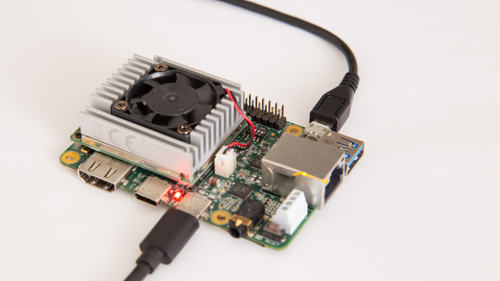
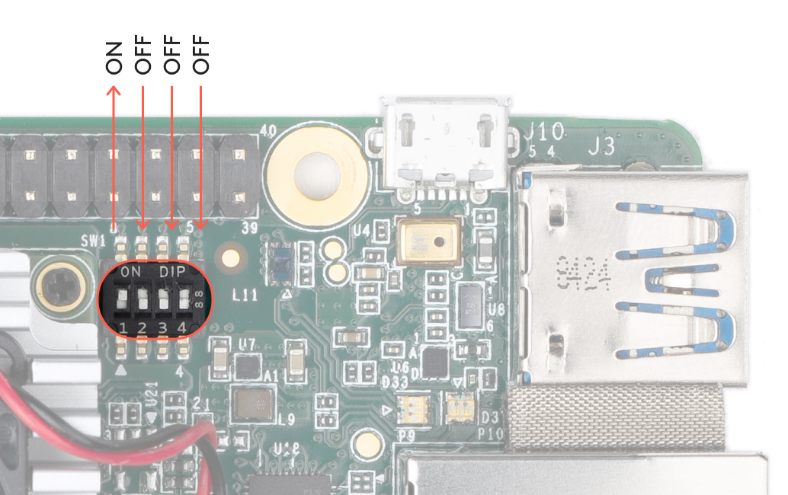
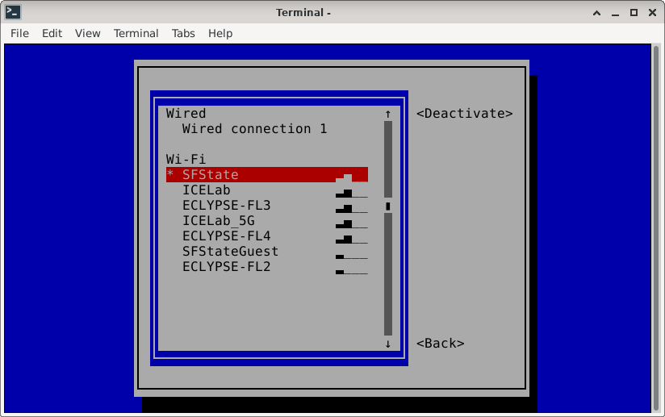

# sensorFusion, Computer Vision: Running

The software will detect if you are running with a Cuda GPU, CPU, or MPS (Apple Silicon)

If you are running GPU or MPS, the inference, pre and post-processing will be done with [Ultralitics](https://docs.ultralytics.com/modes/train/)

However the assumption is we will want to run with the TPU, running on a desktop/laptop/server is mostly for debugging.

If you are running on a TPU board the inference will be done with TensorFlow Lite, pre and post-processing via [jveitchmichaelis' edgetpu-yolo](https://github.com/jveitchmichaelis/edgetpu-yolo)
 
[Documentation on preparing and using the Corel Dev Board](https://coral.ai/docs/dev-board/get-started) is fairly complete and easy to follow.
I will present a distilled version with some notes.
I was installing from a laptop running Debian Linux, and from OSX.

The instructions are broken down to:
- [Serial Terminal](#serial-term)
- [Powering the board](#board-power)
- [Install the TPU OS](#install-os)
- [Configureing the Corel TPU Devboard](#configure-tpu): Network, ssh, etc
- [Installing the Software](#software-install)
- [Running The Software](#operation)

 

<h3 id="serial-term">Serial Terminal:</h3>

> The [serial console](https://coral.ai/docs/dev-board/serial-console/ "Corel Dev Board Serial Console") for the dev-board is unusual: 
>   
> - The console port is the Micro-USB port on the same side as the 20 pin IO Pin Header
> - The serial console power is sent via the USB-Micro-B connection, not via the main power.
>   - The TX/RX lights will illuminate on Console port power, then turn off when the board powers
> - The serial will be available to the host prior to powering the board. It will, of course, not transmit any data until the board is powered.
> - It is recommended to connect to the serial console prior to powering the board
> - The serial settings are (115200, 8-N-1):
>   - Speed: 115200
>   - Data Bits: 8
>   - Parity Bit: None
>   - Stop Bits: 1
> - Default Credentials
>   - Username: mendel
>   - Password: mendel
>1. [Make sure your account on your host has permission to use the serial port. ](https://coral.ai/docs/dev-board/serial-console/ "Corel Dev Board Serial Console")
>1. Install "Screen" (or other terminal software, Note: on windows PuTTY is nice)
>1. Connect the Micro-USB to the host computer usb port.
>1. Determine the USB port (e.x. /dev/ttyUSB0)
>  - On Linux:
>    1. dmesg | grep ttyUSB
>    1. Select the first entry
>  - On OSX:
>    1. It will be: /dev/cu.SLAB_USBtoUART
>  - On Windows:
>    1. Install the driver (It should auto install when plugging the cable in)
>    1. Open the Device Manager (assuming MS has not moved it)
>    1. Look under "Ports (COM & LPT)" for Silicon Labs Dual CP2105 USB to UART Bridge"
>    2. The one that says something like: "Enhanced COM Port" (such as "COM3")"
>1. Connect to the board:
>   - screen /dev/ttyUSB0 115200
>   - To exit screen: <CTRL>+A, K, Y

 

<h3 id="board-power">Powering the board:</h3>

>- ** DO NOT POWER FROM YOUR COMPUTER** The board draws 2-3A, this may bork your computer's usb-c connection
>- Use an external power supply that can source 3A at 5V (some laptop supplies are plenty good at 20V, but don't have much or any at 5V)
>- Use a usb-c cable that is good for 3A
>- There are 2 USB-C connections, one is for data (next to the HDMI), the other is power (next to the audio):  
>- Note: the red LED that comes on with power. The fan will also spin, and the serial port should start talking.

 

<h3 id="install-os">Install the TPU OS:</h3>

> - The operating system is out of date. As of this writting (Aug 2024), the newest version of [mendel linux](https://coral.ai/software/#mendel-linux) is from Nov 2021
> - Unlike a raspberry Pi, the OS must be installed on the internal memory, the computer can not boot from the microSD card (or at least not easily)
> - [There is a way](https://coral.ai/docs/dev-board/reflash/#flash-a-new-board) of flashing via USB, however I was not able to get it to work. Its possible that I had some silly error. But I did not spend too much time as I have a functioning SD Card. This also will not work for a fresh install, but should presev /home
>1. Download [Mendel Linux](https://coral.ai/software/#mendel-linux)
>  - Latest flashcard [enterprise-eagle-flashcard-20211117215217.zip](https://dl.google.com/coral/mendel/enterprise/enterprise-eagle-flashcard-20211117215217.zip)
>1. Put the image on a microSD card
>   1. Unzip the file
>   1. Determine which file is your SD Card
>      - df -l
>        - "df = disk format (asking not telling), -l = only show local disks
>      - This will give a list of mount points. If there is any doubt, un-mount and eject the card and run the df again, looking for changes
>      - If your disk is not already formatted for your OS, a df will not show. You can either use your os to format it, or go down a rabbit hole... Up to you.
>   1. Use dd to write the image e.x.:
>     - sudo dd if=flashcard_arm64.img of=/dev/disk7
>        - sudo = do as root
>        - dd = convert and copy a file
>        - if = infile
>        - of = outfile
>     - NOTE: this will overwrite whatever disk is pointed to with "of=<diskname>" by overwrite, I mean destroy. So, be durn spanky sure you have the correct disk.  
>1. Insert the SD Card to the Dev-Board card slot
> 1. Set the TPU to boot from SD
>    - The Dev board boot target is selected via the dip switches (Internal Memory Boot mode show):
>   
>6. Install the OS to internal memory
>  1. Connect to the serial consol (and/or plug a monitor in)
>  2. Power the board (this takes a while)
>  3. When the board says "Power Down" It is done
>1. Unplug the serial port and power (the serial is probably over kill, but why kill when you can overkill)
> 8. Set the TPU to boot from internal memory
> 1. Connect to the serial consol (and/or plug a monitor, keyboard, and mouse in)
> 10. Re-Power the board
>   - When boot is complete the serial terminal will present the Mendel Linux logon prompt (the monitor will show the GUI)

Dip Switch Configuration:
| Boot Mode | 1 | 2 | 3 | 4 |
|:-----------|---|---|---|---|
| SD Card | ON | OFF | ON | ON |
| Internal Memory | ON | OFF | OFF | OFF |

 

<h3 id="configure-tpu">Configuring and operating the Corel TPU devboard:</h3>

> - Network
>   - The "easy" way to get the network setup is with nmtui
>   - This can be done with comandline arguments, or with the consol tool, we will use the tool
>    
>      1. from a shell run: nmtui
>      2. Select "Activate a connection
>         - You should see a list of available connections
>         - If is does not show the list arrow down, it should refresh...
>      1. Select your Network <activate>
>         - Key in your password
>   - Setting up as a WIFI Host:
>      1. foobar
> - Logging into the board (e.x. ssh)
>   - Logon keys and other chicken egg problems
>   - Password SSH is disabled so we have a few options
>     - Enable It
>     - [Manualy create a public/private key pair](https://coral.ai/docs/dev-board/mdt/#mdt-on-macos) on the devboard (If you are on a MAC you must use this path)
>     - Use the [Mendel Devolopment Tool (MDT)](https://coral.ai/docs/dev-board/mdt/)
>       1. Install MDT on the host computer (your laptop/desktop)
>          1. python3 -m pip install --user mendel-development-tool
>       1. Connect MDT to the development board
>          1. Plug the data USB-C port on the development bord to a USB port on your host computer.
>       1. If you are using ssh and don't already have a ssh public/private key pair:
>          1. From the host computer: ssh-keygen
>          2. From the host computer: mdt pushkey ~/.ssh/id_rsa.pub
>       1. Terminal into the board
>          - SSH to the developemnt board
>            1. Determine the development board IP
>               2. From the serial consol (or kvm): sudo ifconfig -a
>            3. ssh mendel@ip address
>          - Use: mdt shell
> - KVM
>   1. Plug USB keyboard and mouse in, it should work, you will need a hub.
> - X11
>   1. Plug monitor into HDMI port. It should work.
>   - Mendel uses [Weston](https://gitlab.freedesktop.org/wayland/weston) under [Wayland](https://wayland.freedesktop.org/) instead of X11.
>   - Cuz life need more layers. Besides who needs remote windows... I got opinions on the topic, go ahead and ask me.

 

<h3 id="software-install">Software Installation:</h3>

This is a 3 year old OS... It will work just fine for us, but give deprecation warnings. We do have to be careful about library usage tho.
>1. Install base code (if you have not already:
>    1. git clone https://github.com/iamtheeel/sensorFusion.git
>       - The required parts of edgetpu-yolo are included. I have modified very little. But have made a few changes that were necessary.
>1. Change directory to sensorFusion/cv/running
>1. install prerequisites:
>    - If on the TPU: Most of the following will give warnings (e.x.):
>    - script pip3.10 is installed in '/home/mendel/.local/bin' which is not on PATH.
>       - Fixable, but not a problem
>       - Consider adding this directory to PATH or, if you prefer to suppress this warning, use --no-warn-script-location.
>         - Fixable, but not a problem
>       - DEPRECATION: reportbug 7.5.3-deb10u1 has a non-standard version number. pip 24.1 will enforce this behaviour change. A possible replacement is to upgrade to a newer version of reportbug or contact the author to suggest that they release a version with a conforming version number. Discussion can be found at https://github.com/pypa/pip/issues/12063
>     1. sudo apt-get install -y python3 python3-pip
>     1. pip3 install --upgrade pip setuptools wheel
>     1. pip install -r --user requirements_tpu.txt
>   - Else (we need ultralitics):
>       - pip install -r requirements.txt

<h3 id="operation">Running The Software:</h3>

> Welp, that was easy... notthing to it right?
> Ok, now we can run the real time software
>1. Connect a head
>    - Keyboard
>    - Mouse
>    - Monitor 
>1. Connect the camera
>    - Determine the camera port 
>1. Configure the settings (cv/config.yaml) and module description
>    - runImage.py: The program entery point
>      - debugs/debug
>      - debugs/dispResults
>      - training/imageSize: Size of the training image set, will set camera to this size
>      - runTime/imgSrc
>        - Single File name (ex: appleHand_hand_4.jpg": Will run the single image
>        - "directory": Will run the images called in runTime/imageDir
>        - "webCam": Will run live from a camera
>          - runTime/camId: Camera id to connect to (e.x. camId: 1)
>          - runTime/camRateHz: The frame rate to use (note: the inference times are on the order of 0.15 sec, so about 5 Hz)
>          - runTime/displaySettings/RunCamOnce: Run a single frame from the camera (usefull for debuging
>    - distance.py: Calculates the distance from the hand and object, and the overlays
>       - training/imageSize: Size of the training image set, will set bounderys of the overlays
>       - runTime/distSettings/imagePxPer_mm: Camera distance calibration
>       - runTime/distSettings/handThreshold: Probability threshold for the hand
>       - runTime/distSettings/objectThreshold: Probability threshold for the object
>       - nmsIouThreshold/handClass: Which class number is the "hand"
>    - display.py: Displays the image and overlays
>       - runTime/displaySettings/fullScreen: Show image full screen or in a window
>       - runTime/displaySettings/handColor
>       - runTime/displaySettings/objectColor
>       - runTime/displaySettings/lineColor
>       - runTime/displaySettings/handLineTh: Thickness of the hand overlay in px
>       - runTime/displaySettings/objLineTh: Thickness of the target object overlay in px
>       - runTime/displaySettings/distLineTh: Thickness of the distance call overlay in px
>    - modelRunTime.py: Calling the appropriate model for the system (e.x. edgetpumodel.py for the corel edge TPU dev board, otherwise ultralitics YOLO)
>       - debugs/showInfResults
>       - training/weightsDir: Location of the model weights file
>          - if tpu: training/weightsFile_tpu
>          - else  : training/weightsFile
>    - edgetpumodel.py, nms.py utils.py: From [edgetpu-yolo](https://github.com/jveitchmichaelis/edgetpu-yolo)
>       - runTime/distSettings/handThreshold: Probability threshold for the hand
>       - runTime/distSettings/objectThreshold: Probability threshold for the object
>       - runTime/distSettings/nmsIouThreshold: For only use if the iou is below this point (tweek if there are overlaying objects, or skipping the overlay>
>       - training/dataSet: the dataset file used during training
>1. Launch the software
>   1. cd sensorFusion/cv/running
>   2. python3 runImage.py
>1. Exiting
>   - In the window press "q" to quit.
>   - If you are running through a directory of images anyother key will go to the next image. 

